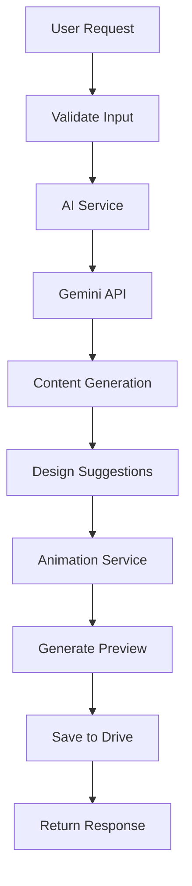
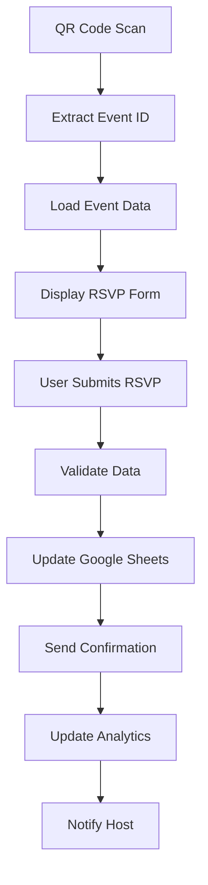
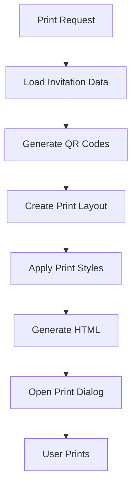

# 🏗️ Technical Architecture Documentation
## RSVP Management App with AI Invitation Generator

---

## 📋 Table of Contents

1. [System Overview](#system-overview)
2. [Architecture Patterns](#architecture-patterns)
3. [Technology Stack](#technology-stack)
4. [Service Architecture](#service-architecture)
5. [Data Flow](#data-flow)
6. [API Design](#api-design)
7. [Database Schema](#database-schema)
8. [Security Architecture](#security-architecture)
9. [Performance Considerations](#performance-considerations)
10. [Scalability Design](#scalability-design)
11. [Monitoring & Logging](#monitoring--logging)
12. [Deployment Architecture](#deployment-architecture)

---

## 🎯 System Overview

The RSVP Management App is built using a microservices-inspired architecture with clear separation of concerns. The system is designed to be modular, scalable, and maintainable while providing a seamless user experience.

### Core Principles
- **Separation of Concerns**: Each service handles a specific domain
- **Loose Coupling**: Services communicate through well-defined interfaces
- **High Cohesion**: Related functionality is grouped together
- **Fault Tolerance**: System continues operating despite component failures
- **Scalability**: Can handle increased load through horizontal scaling

---

## 🏛️ Architecture Patterns

### 1. Service-Oriented Architecture (SOA)
```
┌─────────────────────────────────────────────────────────────┐
│                    Presentation Layer                       │
├─────────────────────────────────────────────────────────────┤
│  HTML/CSS/JS  │  Mobile App  │  API Gateway  │  Admin Panel │
├─────────────────────────────────────────────────────────────┤
│                    Application Layer                        │
├─────────────────────────────────────────────────────────────┤
│  Express.js Router  │  Middleware  │  Authentication  │     │
├─────────────────────────────────────────────────────────────┤
│                      Service Layer                          │
├─────────────────────────────────────────────────────────────┤
│ AI Service │ Event Service │ RSVP Service │ QR Service │    │
├─────────────────────────────────────────────────────────────┤
│                    Data Access Layer                        │
├─────────────────────────────────────────────────────────────┤
│ Google Drive │ Google Sheets │ File System │ Cache Layer │  │
└─────────────────────────────────────────────────────────────┘
```

### 2. Event-Driven Architecture
```javascript
// Event Bus Implementation
class EventBus {
    constructor() {
        this.events = new Map();
    }
    
    on(event, callback) {
        if (!this.events.has(event)) {
            this.events.set(event, []);
        }
        this.events.get(event).push(callback);
    }
    
    emit(event, data) {
        if (this.events.has(event)) {
            this.events.get(event).forEach(callback => callback(data));
        }
    }
}

// Usage Examples
eventBus.on('invitation.generated', (invitation) => {
    // Update analytics
    // Send notifications
    // Cache results
});

eventBus.on('rsvp.submitted', (rsvp) => {
    // Update guest count
    // Send confirmation
    // Update dashboard
});
```

### 3. Repository Pattern
```javascript
// Abstract Repository
class BaseRepository {
    constructor(dataSource) {
        this.dataSource = dataSource;
    }
    
    async findById(id) {
        throw new Error('Method must be implemented');
    }
    
    async save(entity) {
        throw new Error('Method must be implemented');
    }
    
    async delete(id) {
        throw new Error('Method must be implemented');
    }
}

// Concrete Implementation
class EventRepository extends BaseRepository {
    async findById(id) {
        return await this.dataSource.getEvent(id);
    }
    
    async save(event) {
        return await this.dataSource.saveEvent(event);
    }
}
```

---

## 🛠️ Technology Stack

### Backend Technologies
```json
{
  "runtime": "Node.js 18+",
  "framework": "Express.js 4.18+",
  "ai": "Google Gemini 2.5 Flash",
  "authentication": "Google OAuth 2.0",
  "storage": "Google Drive API",
  "database": "Google Sheets API",
  "qr_codes": "qrcode.js",
  "animations": "Three.js, GSAP",
  "testing": "Custom test suites",
  "logging": "Winston",
  "validation": "Joi"
}
```

### Frontend Technologies
```json
{
  "html": "HTML5 with semantic markup",
  "css": "CSS3 with Flexbox/Grid",
  "javascript": "ES6+ with modules",
  "animations": "GSAP, Three.js",
  "responsive": "Mobile-first design",
  "accessibility": "WCAG 2.1 compliant",
  "performance": "Lazy loading, code splitting"
}
```

### Development Tools
```json
{
  "package_manager": "npm",
  "version_control": "Git",
  "code_quality": "ESLint, Prettier",
  "testing": "Custom test frameworks",
  "documentation": "JSDoc, Markdown",
  "deployment": "Docker, Railway"
}
```

---

## 🔧 Service Architecture

### Service Layer Design
```
services/
├── aiInvitationService.js      # AI-powered invitation generation
│   ├── generateInvitation()    # Main generation method
│   ├── generateContent()       # AI content creation
│   ├── generateDesign()        # Design suggestions
│   └── getFallbackContent()    # Fallback when AI fails
│
├── geminiService.js           # Gemini AI integration
│   ├── generateInvitationContent()  # AI content generation
│   ├── generateDesignSuggestions()  # Design recommendations
│   ├── generatePersonalizedMessages() # Guest-specific content
│   └── testConnection()       # Health check
│
├── animationService.js        # 3D animations and effects
│   ├── createCardAnimation()  # Card opening animation
│   ├── createParticleEffect() # Particle systems
│   ├── createRevealAnimation() # Content reveal
│   └── optimizePerformance()  # Performance optimization
│
├── eventService.js           # Event management
│   ├── createEvent()         # Create new events
│   ├── updateEvent()         # Update existing events
│   ├── deleteEvent()         # Remove events
│   └── getEventAnalytics()   # Event statistics
│
├── rsvpService.js            # RSVP processing
│   ├── submitRSVP()          # Process RSVP responses
│   ├── getRSVPStats()        # Response statistics
│   ├── sendConfirmation()    # Confirmation emails
│   └── exportData()          # Data export
│
├── qrCodeService.js          # QR code generation
│   ├── generateQRCode()      # Single QR code
│   ├── generateBatch()       # Multiple QR codes
│   ├── validateQRCode()      # QR code validation
│   └── getQRCodeStats()      # Usage statistics
│
├── googleDrive.js            # Google Drive integration
│   ├── uploadFile()          # File upload
│   ├── downloadFile()        # File download
│   ├── createFolder()        # Folder creation
│   └── syncData()            # Data synchronization
│
├── googleSheetsService.js    # Google Sheets integration
│   ├── createSheet()         # Create new sheets
│   ├── updateSheet()         # Update existing sheets
│   ├── readData()            # Read sheet data
│   └── exportToCSV()         # CSV export
│
└── emailService.js           # Email notifications
    ├── sendInvitation()      # Send invitations
    ├── sendReminder()        # Send reminders
    ├── sendConfirmation()    # Send confirmations
    └── sendNotification()    # General notifications
```

### Service Communication
```javascript
// Service Factory Pattern
class ServiceFactory {
    static createService(serviceName, dependencies) {
        switch (serviceName) {
            case 'aiInvitation':
                return new AIInvitationService(
                    dependencies.geminiService,
                    dependencies.animationService
                );
            case 'rsvp':
                return new RSVPService(
                    dependencies.googleSheets,
                    dependencies.emailService
                );
            default:
                throw new Error(`Unknown service: ${serviceName}`);
        }
    }
}

// Dependency Injection
class ServiceContainer {
    constructor() {
        this.services = new Map();
        this.initializeServices();
    }
    
    initializeServices() {
        // Initialize core services
        this.services.set('geminiService', new GeminiService());
        this.services.set('googleDrive', new GoogleDriveService());
        this.services.set('googleSheets', new GoogleSheetsService());
        
        // Initialize dependent services
        this.services.set('aiInvitation', new AIInvitationService(
            this.services.get('geminiService')
        ));
    }
    
    get(serviceName) {
        return this.services.get(serviceName);
    }
}
```

---

## 📊 Data Flow

### 1. Invitation Generation Flow


### 2. RSVP Processing Flow


### 3. Print Generation Flow


---

## 🔌 API Design

### RESTful API Principles
```javascript
// Resource-based URLs
GET    /api/events              // List all events
GET    /api/events/:id          // Get specific event
POST   /api/events              // Create new event
PUT    /api/events/:id          // Update event
DELETE /api/events/:id          // Delete event

// Nested resources
GET    /api/events/:id/rsvps    // Get RSVPs for event
POST   /api/events/:id/rsvps    // Submit RSVP for event
GET    /api/events/:id/invites  // Get invitations for event
```

### API Response Format
```javascript
// Success Response
{
  "success": true,
  "data": {
    // Response data
  },
  "meta": {
    "timestamp": "2025-09-27T08:35:21.533Z",
    "version": "1.0.0",
    "requestId": "req_123456789"
  }
}

// Error Response
{
  "success": false,
  "error": {
    "code": "VALIDATION_ERROR",
    "message": "Invalid input data",
    "details": {
      "field": "eventDate",
      "reason": "Date must be in the future"
    }
  },
  "meta": {
    "timestamp": "2025-09-27T08:35:21.533Z",
    "version": "1.0.0",
    "requestId": "req_123456789"
  }
}
```

### API Versioning
```javascript
// URL-based versioning
/api/v1/events
/api/v2/events

// Header-based versioning
Accept: application/vnd.rsvp-app.v1+json
Accept: application/vnd.rsvp-app.v2+json
```

---

## 🗄️ Database Schema

### Google Sheets Schema
```javascript
// Events Sheet
{
  "eventId": "string (UUID)",
  "eventName": "string",
  "eventDate": "date",
  "eventTime": "time",
  "eventLocation": "string",
  "hostName": "string",
  "hostEmail": "string",
  "eventType": "enum [birthday, wedding, corporate, holiday, casual]",
  "maxGuests": "number",
  "createdAt": "timestamp",
  "updatedAt": "timestamp",
  "status": "enum [draft, active, completed, cancelled]"
}

// RSVPs Sheet
{
  "rsvpId": "string (UUID)",
  "eventId": "string (UUID)",
  "inviteId": "string (UUID)",
  "guestName": "string",
  "guestEmail": "string",
  "attendance": "enum [yes, no, maybe]",
  "guestCount": "number",
  "dietaryRestrictions": "string",
  "additionalNotes": "string",
  "submittedAt": "timestamp",
  "ipAddress": "string",
  "userAgent": "string"
}

// Invitations Sheet
{
  "invitationId": "string (UUID)",
  "eventId": "string (UUID)",
  "inviteId": "string (UUID)",
  "qrCodeDataURL": "string",
  "rsvpUrl": "string",
  "theme": "string",
  "animationType": "string",
  "generatedAt": "timestamp",
  "printedAt": "timestamp",
  "scannedAt": "timestamp"
}
```

### Google Drive File Structure
```
RSVP-App/
├── Events/
│   ├── {eventId}/
│   │   ├── invitations/
│   │   │   ├── front-design.png
│   │   │   ├── back-design.png
│   │   │   └── qr-codes/
│   │   ├── photos/
│   │   └── exports/
│   └── templates/
├── Analytics/
│   ├── reports/
│   └── dashboards/
└── Backups/
    └── daily/
```

---

## 🔒 Security Architecture

### Authentication & Authorization
```javascript
// JWT Token Structure
{
  "header": {
    "alg": "RS256",
    "typ": "JWT"
  },
  "payload": {
    "sub": "user_id",
    "iss": "rsvp-app",
    "aud": "rsvp-app-users",
    "exp": 1640995200,
    "iat": 1640908800,
    "scope": ["read:events", "write:events", "admin:users"]
  }
}

// Role-Based Access Control
const roles = {
  'admin': ['*'],
  'host': ['read:events', 'write:events', 'read:rsvps', 'write:rsvps'],
  'guest': ['read:events', 'write:rsvps']
};
```

### Data Protection
```javascript
// Input Validation
const eventSchema = Joi.object({
  eventName: Joi.string().min(1).max(100).required(),
  eventDate: Joi.date().min('now').required(),
  eventTime: Joi.string().pattern(/^([0-1]?[0-9]|2[0-3]):[0-5][0-9]$/).required(),
  eventLocation: Joi.string().min(1).max(200).required(),
  hostName: Joi.string().min(1).max(100).required(),
  hostEmail: Joi.string().email().required()
});

// Data Sanitization
const sanitizeInput = (input) => {
  return DOMPurify.sanitize(input, {
    ALLOWED_TAGS: [],
    ALLOWED_ATTR: []
  });
};

// Rate Limiting
const rateLimit = require('express-rate-limit');
const limiter = rateLimit({
  windowMs: 15 * 60 * 1000, // 15 minutes
  max: 100, // limit each IP to 100 requests per windowMs
  message: 'Too many requests from this IP'
});
```

### Security Headers
```javascript
// Helmet.js Configuration
app.use(helmet({
  contentSecurityPolicy: {
    directives: {
      defaultSrc: ["'self'"],
      styleSrc: ["'self'", "'unsafe-inline'"],
      scriptSrc: ["'self'"],
      imgSrc: ["'self'", "data:", "https:"],
      connectSrc: ["'self'", "https://api.google.com"]
    }
  },
  hsts: {
    maxAge: 31536000,
    includeSubDomains: true,
    preload: true
  }
}));
```

---

## ⚡ Performance Considerations

### Caching Strategy
```javascript
// Redis Cache Implementation
class CacheService {
    constructor(redisClient) {
        this.redis = redisClient;
        this.defaultTTL = 3600; // 1 hour
    }
    
    async get(key) {
        const value = await this.redis.get(key);
        return value ? JSON.parse(value) : null;
    }
    
    async set(key, value, ttl = this.defaultTTL) {
        await this.redis.setex(key, ttl, JSON.stringify(value));
    }
    
    async invalidate(pattern) {
        const keys = await this.redis.keys(pattern);
        if (keys.length > 0) {
            await this.redis.del(...keys);
        }
    }
}

// Cache Usage Examples
const cacheKey = `event:${eventId}`;
let event = await cache.get(cacheKey);
if (!event) {
    event = await eventService.getEvent(eventId);
    await cache.set(cacheKey, event, 1800); // 30 minutes
}
```

### Database Optimization
```javascript
// Connection Pooling
const pool = mysql.createPool({
    connectionLimit: 10,
    host: process.env.DB_HOST,
    user: process.env.DB_USER,
    password: process.env.DB_PASSWORD,
    database: process.env.DB_NAME,
    acquireTimeout: 60000,
    timeout: 60000,
    reconnect: true
});

// Query Optimization
const optimizedQuery = `
    SELECT e.*, 
           COUNT(r.rsvpId) as rsvpCount,
           AVG(r.guestCount) as avgGuestCount
    FROM events e
    LEFT JOIN rsvps r ON e.eventId = r.eventId
    WHERE e.status = 'active'
    GROUP BY e.eventId
    HAVING rsvpCount > 0
    ORDER BY e.eventDate ASC
    LIMIT 20
`;
```

### Frontend Performance
```javascript
// Lazy Loading
const LazyComponent = React.lazy(() => import('./HeavyComponent'));

// Code Splitting
const routes = [
    {
        path: '/invitation-generator',
        component: React.lazy(() => import('./InvitationGenerator'))
    },
    {
        path: '/host-dashboard',
        component: React.lazy(() => import('./HostDashboard'))
    }
];

// Image Optimization
const optimizedImage = {
    src: imageUrl,
    loading: 'lazy',
    decoding: 'async',
    sizes: '(max-width: 768px) 100vw, 50vw',
    srcSet: `${imageUrl}?w=400 400w, ${imageUrl}?w=800 800w`
};
```

---

## 📈 Scalability Design

### Horizontal Scaling
```javascript
// Load Balancer Configuration
const loadBalancer = {
    strategy: 'round-robin',
    healthCheck: {
        path: '/health',
        interval: 30000,
        timeout: 5000
    },
    servers: [
        { host: 'app1.example.com', port: 3000, weight: 1 },
        { host: 'app2.example.com', port: 3000, weight: 1 },
        { host: 'app3.example.com', port: 3000, weight: 1 }
    ]
};

// Session Management
const sessionConfig = {
    store: new RedisStore({
        host: process.env.REDIS_HOST,
        port: process.env.REDIS_PORT,
        pass: process.env.REDIS_PASSWORD
    }),
    secret: process.env.SESSION_SECRET,
    resave: false,
    saveUninitialized: false,
    cookie: {
        secure: process.env.NODE_ENV === 'production',
        maxAge: 24 * 60 * 60 * 1000 // 24 hours
    }
};
```

### Microservices Architecture
```javascript
// Service Discovery
class ServiceRegistry {
    constructor() {
        this.services = new Map();
    }
    
    register(serviceName, serviceUrl, healthCheck) {
        this.services.set(serviceName, {
            url: serviceUrl,
            healthCheck: healthCheck,
            lastHealthCheck: Date.now(),
            status: 'healthy'
        });
    }
    
    async discover(serviceName) {
        const service = this.services.get(serviceName);
        if (!service) {
            throw new Error(`Service ${serviceName} not found`);
        }
        
        // Health check
        if (Date.now() - service.lastHealthCheck > 30000) {
            await this.healthCheck(service);
        }
        
        return service.url;
    }
}

// Circuit Breaker Pattern
class CircuitBreaker {
    constructor(threshold = 5, timeout = 60000) {
        this.threshold = threshold;
        this.timeout = timeout;
        this.failureCount = 0;
        this.lastFailureTime = null;
        this.state = 'CLOSED'; // CLOSED, OPEN, HALF_OPEN
    }
    
    async execute(operation) {
        if (this.state === 'OPEN') {
            if (Date.now() - this.lastFailureTime > this.timeout) {
                this.state = 'HALF_OPEN';
            } else {
                throw new Error('Circuit breaker is OPEN');
            }
        }
        
        try {
            const result = await operation();
            this.onSuccess();
            return result;
        } catch (error) {
            this.onFailure();
            throw error;
        }
    }
}
```

---

## 📊 Monitoring & Logging

### Logging Strategy
```javascript
// Winston Logger Configuration
const logger = winston.createLogger({
    level: 'info',
    format: winston.format.combine(
        winston.format.timestamp(),
        winston.format.errors({ stack: true }),
        winston.format.json()
    ),
    defaultMeta: { service: 'rsvp-app' },
    transports: [
        new winston.transports.File({ filename: 'logs/error.log', level: 'error' }),
        new winston.transports.File({ filename: 'logs/combined.log' }),
        new winston.transports.Console({
            format: winston.format.simple()
        })
    ]
});

// Structured Logging
const logEvent = (event, data) => {
    logger.info('Event occurred', {
        event: event,
        timestamp: new Date().toISOString(),
        data: data,
        requestId: data.requestId,
        userId: data.userId
    });
};
```

### Performance Monitoring
```javascript
// Metrics Collection
const metrics = {
    requestCount: new prometheus.Counter({
        name: 'http_requests_total',
        help: 'Total number of HTTP requests',
        labelNames: ['method', 'route', 'status_code']
    }),
    
    requestDuration: new prometheus.Histogram({
        name: 'http_request_duration_seconds',
        help: 'Duration of HTTP requests in seconds',
        labelNames: ['method', 'route']
    }),
    
    activeConnections: new prometheus.Gauge({
        name: 'active_connections',
        help: 'Number of active connections'
    })
};

// Health Check Endpoint
app.get('/health', async (req, res) => {
    const health = {
        status: 'OK',
        timestamp: new Date().toISOString(),
        uptime: process.uptime(),
        memory: process.memoryUsage(),
        services: {
            database: await checkDatabaseHealth(),
            redis: await checkRedisHealth(),
            gemini: await checkGeminiHealth()
        }
    };
    
    res.json(health);
});
```

---

## 🚀 Deployment Architecture

### Container Architecture
```dockerfile
# Multi-stage Dockerfile
FROM node:18-alpine AS builder
WORKDIR /app
COPY package*.json ./
RUN npm ci --only=production

FROM node:18-alpine AS runtime
WORKDIR /app
COPY --from=builder /app/node_modules ./node_modules
COPY . .
EXPOSE 3000
CMD ["npm", "start"]
```

### Kubernetes Deployment
```yaml
apiVersion: apps/v1
kind: Deployment
metadata:
  name: rsvp-app
spec:
  replicas: 3
  selector:
    matchLabels:
      app: rsvp-app
  template:
    metadata:
      labels:
        app: rsvp-app
    spec:
      containers:
      - name: rsvp-app
        image: rsvp-app:latest
        ports:
        - containerPort: 3000
        env:
        - name: NODE_ENV
          value: "production"
        - name: GEMINI_API_KEY
          valueFrom:
            secretKeyRef:
              name: api-secrets
              key: gemini-api-key
        resources:
          requests:
            memory: "256Mi"
            cpu: "250m"
          limits:
            memory: "512Mi"
            cpu: "500m"
        livenessProbe:
          httpGet:
            path: /health
            port: 3000
          initialDelaySeconds: 30
          periodSeconds: 10
        readinessProbe:
          httpGet:
            path: /health
            port: 3000
          initialDelaySeconds: 5
          periodSeconds: 5
```

### CI/CD Pipeline
```yaml
# GitHub Actions Workflow
name: CI/CD Pipeline
on:
  push:
    branches: [main]
  pull_request:
    branches: [main]

jobs:
  test:
    runs-on: ubuntu-latest
    steps:
    - uses: actions/checkout@v2
    - name: Setup Node.js
      uses: actions/setup-node@v2
      with:
        node-version: '18'
    - name: Install dependencies
      run: npm ci
    - name: Run tests
      run: npm test
    - name: Run linting
      run: npm run lint

  deploy:
    needs: test
    runs-on: ubuntu-latest
    if: github.ref == 'refs/heads/main'
    steps:
    - name: Deploy to production
      run: |
        docker build -t rsvp-app:${{ github.sha }} .
        docker push rsvp-app:${{ github.sha }}
        kubectl set image deployment/rsvp-app rsvp-app=rsvp-app:${{ github.sha }}
```

---

## 🔧 Development Guidelines

### Code Organization
```
src/
├── controllers/          # Request handlers
├── services/            # Business logic
├── repositories/        # Data access
├── models/             # Data models
├── middleware/         # Express middleware
├── routes/             # Route definitions
├── utils/              # Utility functions
├── config/             # Configuration
└── tests/              # Test files
```

### Error Handling
```javascript
// Global Error Handler
app.use((error, req, res, next) => {
    logger.error('Unhandled error', {
        error: error.message,
        stack: error.stack,
        requestId: req.id,
        url: req.url,
        method: req.method
    });
    
    res.status(error.status || 500).json({
        success: false,
        error: {
            code: error.code || 'INTERNAL_ERROR',
            message: process.env.NODE_ENV === 'production' 
                ? 'Internal server error' 
                : error.message
        }
    });
});

// Custom Error Classes
class ValidationError extends Error {
    constructor(message, field) {
        super(message);
        this.name = 'ValidationError';
        this.status = 400;
        this.field = field;
    }
}

class NotFoundError extends Error {
    constructor(resource) {
        super(`${resource} not found`);
        this.name = 'NotFoundError';
        this.status = 404;
    }
}
```

---

## 📚 Conclusion

This technical architecture provides a solid foundation for the RSVP Management App with AI Invitation Generator. The system is designed to be:

- **Scalable**: Can handle increased load through horizontal scaling
- **Maintainable**: Clear separation of concerns and modular design
- **Reliable**: Fault-tolerant with comprehensive error handling
- **Secure**: Multiple layers of security and data protection
- **Performant**: Optimized for speed and efficiency
- **Observable**: Comprehensive monitoring and logging

The architecture supports future enhancements and can evolve with changing requirements while maintaining system stability and performance.

---

*Last Updated: September 27, 2025*
*Version: 1.0.0*
*Architecture Version: 1.0.0*
